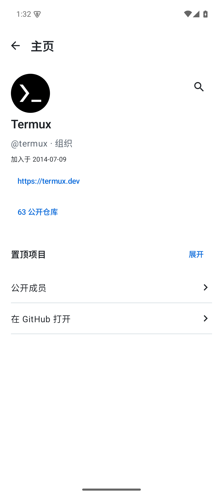
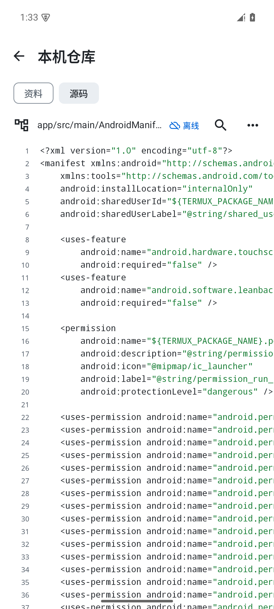

# RepoRove

**把 GitHub 装进你的阅读日常。**

发现感兴趣的项目，读懂文档和代码，保存下来，随时接着看。

[下载安装](https://github.com/zurrll/RepoRove/releases/tag/v0.6.0) · [使用指南](docs/使用指南.md) · [更新记录](CHANGELOG.md) · [反馈问题](https://github.com/zurrll/RepoRove/issues)

Android 10+ · 原生 Android · 清晰 / 纸感主题 · MIT 开源

## 看看它的样子

<table>
<tr>
<td align="center"> <b>认识一个项目</b></td>
<td align="center"> <b>专心读文档</b></td>
<td align="center"> <b>随时翻源码</b></td>
</tr>
<tr>
<td align="center"> <b>发现下一份兴趣</b></td>
<td align="center"> <b>看看谁在创造</b></td>
<td align="center"> <b>断网也能接着读</b></td>
</tr>
</table>

截图来自实际 Android App，使用 GitHub 上的公开项目；网络内容会随项目更新。

## 你可以用它做什么

### 发现值得打开的仓库

浏览 GitHub 官方主题与精选合集，用热门排序找项目，也可以在“为你”填写自己的兴趣。兴趣支持自由输入；不感兴趣的推荐可以调整和撤销。官方目录和 App 的兴趣推荐有清楚的来源区分。

### 让项目介绍更容易读

README 和其他 Markdown 默认用阅读模式打开。标题、粗体、链接、表格、代码块各有层次；宽表格和长代码块可以横向滑动。点章节跳到对应位置，点文档链接继续阅读，返回后接着看原来的地方。

### 在手机上找文件、看代码

一行一个文件或目录，随时呼出文件树，切换最近打开的文件。文本代码有行号和基础语法高亮，支持换行、全文查找与跳行。长文件分段显示，“复制整个文件”复制完整原文，选字复制只复制你的选区。

### 保存以后要读的内容

“稍后看”是待阅读清单，GitHub Star 是账号里的收藏，App 内跟踪把项目后续活动汇总到动态页。项目库还可以访问我的仓库、Star、下载以及最近阅读。

### 把仓库带到离线环境

资料和源码可以分开保存，也可以一起保存。下载完成后，断网打开本机快照，继续读 README、看目录和文本代码；联网后可以更新快照。离线保存固定在一个提交，方便知道自己读的是哪个版本。

### 跟上项目和作者

在 App 内看用户和组织主页、Issue、Pull Request、文件差异、Release 和 Actions。通知尽量打开对应的评论、评审或运行详情。先看版本说明，再下载公开附件；下载页能打开和删除文件。

## 开始使用

1. 从 [最新预览版](https://github.com/zurrll/RepoRove/releases/tag/v0.6.0) 下载 `RepoRove-0.6.0-preview.apk`，在 Android 手机上安装。
2. 不登录也能浏览公开项目。需要 Star、我的仓库、组织或收件箱时，在“我的”中添加 GitHub 访问令牌，具体步骤见 [登录说明](docs/使用指南.md#登录与账号)。
3. 在“我的 → 设置”选择清晰或纸感主题、明暗模式和字号。底部导航、仓库栏目也可以按自己的习惯调整。

已有同签名预览版可以覆盖安装。历史版本均在 [Releases](https://github.com/zurrll/RepoRove/releases) 提供，建议从最新版本开始。

## 当前进度

RepoRove 处于预览阶段，当前版本 **0.6.0**。基础阅读与下载优先，持续积累体验反馈后集中改进。

- 目前提供 APK 安装，尚未上架应用商店。预览包沿用开发签名。
- 当前发布包支持令牌登录；项目自己的浏览器 OAuth 登录尚未配置。
- 主要面向普通 Android 手机，其他尺寸、系统以及一加 Ace 5 / ColorOS 16 的本轮真机回归仍待验证。
- 离线源码不含 Git 历史、子模块和 LFS 实体；单个文本预览上限 1 MiB。公式和 Mermaid 图形暂以源码显示，复杂 GitHub 交互仍有边界。
- AI 翻译已在 0.6.0 移除，先把阅读体验做好。

更多使用边界见 [使用指南](docs/使用指南.md)。这是独立项目，与 GitHub 官方没有隶属关系。

## 一起改进

遇到问题请到 [Issues](https://github.com/zurrll/RepoRove/issues) 写下版本、设备、操作步骤与实际结果，截图请遮住令牌和私有内容。欢迎分享真实使用体验，也欢迎提交改进。

源码使用 [MIT License](LICENSE)。第三方目录与依赖保留各自许可，见 [致谢与第三方说明](THIRD_PARTY_NOTICES.md)。开发、构建和测试请看 [CONTRIBUTING](CONTRIBUTING.md)；历次产品讨论与验收记录收在 [文档索引](文档索引.md)。
