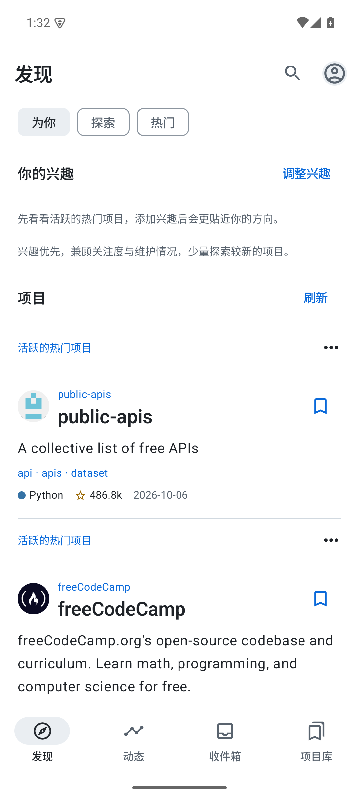
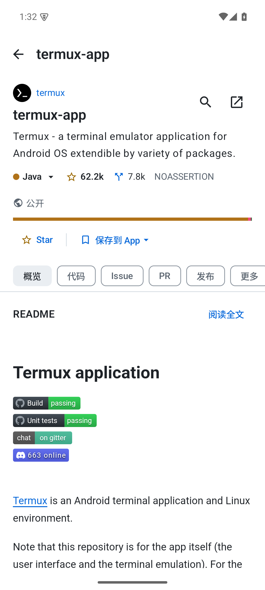
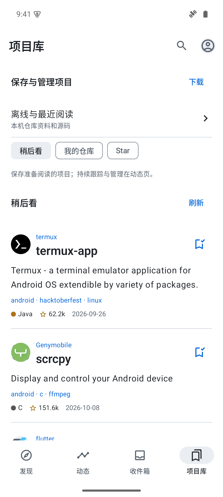
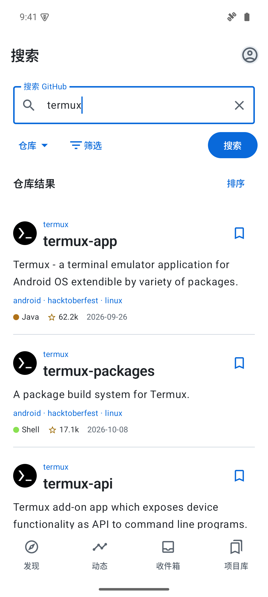
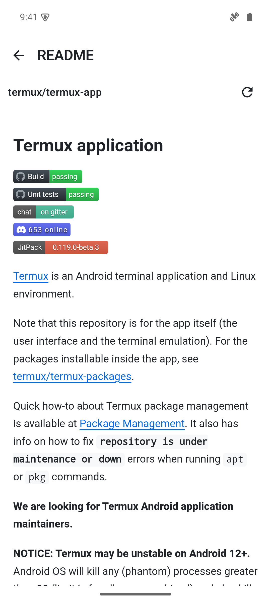
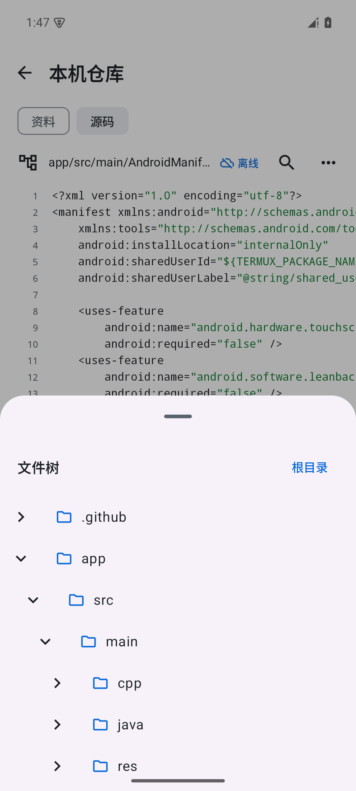

# RepoRove

**在 Android 上发现、浏览和收藏 GitHub 项目。**

找感兴趣的开源项目，读文档与代码，下载发布版本，把想继续看的项目留在手边。也可以查看关注动态、GitHub 通知，以及 Issue、PR 和构建情况。

[下载 APK](https://github.com/zurrll/RepoRove/releases) · [使用指南](docs/使用指南.md) · [更新记录](CHANGELOG.md) · [反馈问题](https://github.com/zurrll/RepoRove/issues)

Android 10+ · 预览版 · MIT 开源

## 看看界面

&nbsp;
&nbsp;

<b>发现项目 · 了解仓库 · 收藏与回访</b>

截图来自实际运行的 Android App，展示 GitHub 公开项目。

## 主要功能

### 发现与搜索

通过主题、精选合集和热门项目寻找新的兴趣，也可以填写自己的兴趣，浏览 RepoRove 的“为你”推荐。搜索覆盖仓库、代码、Issue、PR、用户与组织等内容，按需选择语言、范围、状态和排序；熟悉 GitHub 查询语法时，也能直接输入。

主题和合集目录来自 GitHub Explore；“为你”由 RepoRove 根据兴趣生成，“热门”使用 GitHub API 排序。

### 仓库与阅读

查看项目介绍、语言占比、README、发布版本，以及作者和组织主页。Markdown 默认以阅读模式呈现，文件树帮助浏览目录与源码；代码阅读提供行号、高亮、文件内查找和跳行。想进一步了解项目时，还可以查看提交记录、Issue、PR 讨论、文件差异和 Actions 详情。

### 收藏与回访

把准备阅读的项目加入“稍后看”，或者 Star 到 GitHub 账号。“项目库”集中提供稍后看、我的仓库、Star、下载以及离线与最近阅读入口，方便找回之前看过或保存的内容。

### 动态与通知

在 App 内跟踪项目，集中浏览它们近期的公开活动；登录后也能查看关注用户的动态。收件箱用于阅读 GitHub 通知，并标记已读或完成。稍后看用于留待阅读，跟踪用于持续关注项目，两者分别管理。

### 下载与离线

查看 Release 版本说明，下载公开发布附件或源码归档，在下载页查看进度和管理文件。

需要断网阅读时，可以把仓库资料和源码保存到 App，两者可分别选择。保存后，从项目库打开本机 README、文件树和文本代码。下载到系统目录的文件和 App 内的离线仓库分别管理。

### 外观与布局

提供清晰、纸感两种主题，以及浅色、深色和跟随系统模式；字号和列表密度也能调整。底部导航、启动页面、仓库栏目和概览模块可按习惯安排，少用的栏目收进“更多”，所有仓库共用一套配置。

更多界面：搜索、文档与源码

&nbsp;
&nbsp;

<b>搜索项目 · 阅读文档 · 浏览源码</b>

## 开始使用

1. 到 [Releases](https://github.com/zurrll/RepoRove/releases) 选择最新预览版，下载 APK 并安装到 Android 手机上。
2. 不登录也能浏览公开项目。需要 Star、我的仓库、组织和收件箱时，点“通过浏览器登录”，复制授权码，在 GitHub 官方网页确认后回到 App。也保留访问令牌登录，步骤见 [登录说明](docs/使用指南.md#登录与账号)。
3. 从发现或搜索打开一个项目，按需要阅读、收藏、下载，或保存到离线仓库。

已有同签名预览版可以覆盖安装。历史安装包和每版更新说明也在 Releases 中提供。

## 当前阶段

RepoRove 正在持续完善，目前提供 Android 预览版 APK，以项目浏览、阅读、收藏和查看活动为主。评论提交、PR 审核和构建重跑等操作尚未完整支持。详细范围和离线保存说明见 [使用指南](docs/使用指南.md)。

这是独立的 GitHub 客户端，与 GitHub 官方没有隶属关系。

## 反馈与贡献

我们通过问卷星收集 RepoRove 的使用体验和改进建议。欢迎 [填写体验问卷](https://v.wjx.cn/vm/PA7J6G9.aspx)，或扫描下方二维码，告诉我们哪里好用、哪里不顺手，以及你希望增加的功能。

欢迎通过 [Issues](https://github.com/zurrll/RepoRove/issues) 分享问题和建议。反馈时附上 App 版本、设备与系统、操作步骤和实际表现，截图请遮住私人信息。

想参与开发，可阅读 [贡献指南](CONTRIBUTING.md)；想了解每版变化，可查看 [更新记录](CHANGELOG.md)。

## 许可

RepoRove 使用 [MIT License](LICENSE)。第三方内容与依赖的许可见 [致谢与第三方说明](THIRD_PARTY_NOTICES.md)。
